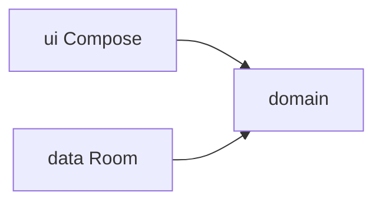

# ADR 001 — Arquitetura inicial

Status: aceite  
Issue: [#17](https://github.com/marciacrisrs/gps-da-vida-app/issues/17)  
Data: 2026-08-15

## Contexto

GPS da Vida monta uma rota diária a partir de eventos, tarefas, hábitos e rotinas, e responde “o que faço agora?”. O valor está no motor local e nas telas Agora / Meu Dia. Sync, conta e IA não entram nesta fase.

## Decisões

| Tema | Escolha |
|------|---------|
| Plataforma | Um app Android, offline-first, sem backend |
| UI | Jetpack Compose, Material 3 |
| Linguagem | Kotlin; identificadores e pacotes em inglês; copy da UI em português |
| Módulos | Um Gradle module `:app` com pacotes `domain` / `data` / `ui` |
| minSdk / target | 26 / 36 (ajustar target na #18 se o template AGP divergir) |
| Namespace / applicationId | `com.gpsdavida.app` |
| DI | Hilt |
| Persistência | Room (única fonte local) |
| Navegação | Navigation Compose |
| Tempo | `java.time.Clock` injetado (testes de atraso/reagendamento) |

Multi-módulo só depois de ADR novo, se o Gradle doer.

## Camadas

```text
app/src/main/java/com/gpsdavida/app/
  domain/          Kotlin puro (sem Android)
    model/
    planning/      motor isolado (agenda, “agora”, recálculo)
    usecase/
    port/          interfaces que data implementa
  data/            Room, mappers, repositórios
  ui/              Compose, ViewModels finos, navigation
  di/              módulos Hilt
```

Dependências: `ui` → `domain` ← `data`. `ui` não importa Room. `domain` não importa Android, Compose nem Room.



## Persistência local

- Room guarda o que o usuário cadastrou e o estado do dia (conclusão, duração real).
- Entidades Room ficam em `data`. Mappers convertem para modelos de `domain`.
- DAOs não vazam para Compose nem para o motor.
- Sem DataStore nesta fase, salvo preferência pontual se a #18 precisar (ex.: tema). Sem rede.

## Navegação

Grafo mínimo (destinos crescem nas issues de tela/CRUD):

- `agora` — tela principal
- `meu_dia` — timeline do dia
- grafo de cadastro depois (#2–#8): eventos, tarefas, hábitos, rotinas, disponibilidade

Uma `Activity` (`MainActivity`) + `NavHost`. ViewModels com escopo de destino/hilt.

## Contratos domínio ↔ UI

A UI só fala com o domínio via use cases. Entrada: intenção do usuário. Saída: modelos imutáveis / estado já calculado.

Contratos iniciais (nomes podem fechar na #1):

| Use case | Para a UI |
|----------|-----------|
| `GetNowRoute` | atividade atual, próxima, depois, relógio |
| `GetDayAgenda` | timeline ordenada + conflitos |
| `CompleteActivity` / `SkipActivity` / `DeferActivity` | novo estado persistido; motor pode recálcular |
| `RecalculateRoute` | disparado por atraso, novo item, cancelamento — não pela UI “na mão” |

Regras de prioridade, duração, horários fixos vs flexíveis e reagendamento vivem em `domain/planning`. ViewModel: chama use case, expõe `UiState`, zero recálculo.

Relógio: Hilt fornece `Clock.systemDefaultZone()` em produção; testes passam `Clock.fixed(...)`.

## Estratégia de testes

1. JVM em `src/test`: motor, use cases, `Clock` fake. Preferência absoluta para #9–#12 e #16.
2. Testes de mapper/repositório com Room in-memory quando houver #18.
3. Compose / instrumentado só nos caminhos críticos (concluir em um toque na Agora).
4. Nome do teste = critério de aceite que ele trava.
5. Qualidade (Lint, Detekt, CI) no fim do lote, skill `android-quality`, depois que #18 existir.

## Evolução para IA

O motor em `domain/planning` é a única porta de “qual é a próxima ação / nova rota”. Uma IA futura (on-device ou remota) entra como outra implementação atrás da mesma porta (`PlanningEngine`), sem reescrever Compose nem Room. Nesta fase a implementação é determinística (regras). Sem SDK de LLM no app agora.

## Fora de escopo

Backend, login, sync, widgets, Wear, XML Views, WorkManager (salvo necessidade explícita depois).

## Próximo

Issue **#18**: esqueleto Gradle/Compose/Hilt/Room/Navigation que respeita este ADR. Depois **#1** (modelo de domínio).
