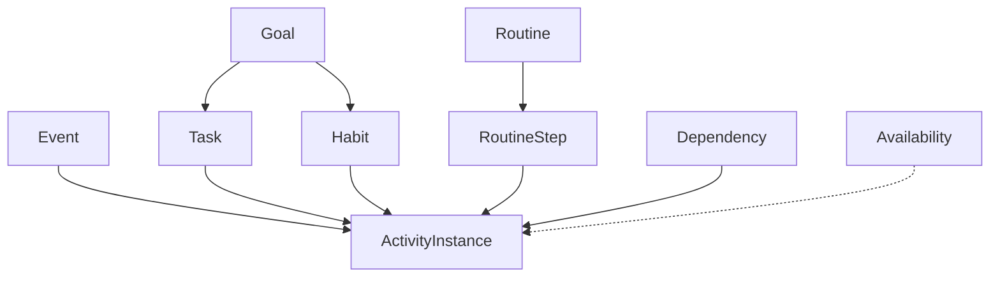

# ADR 002 — Modelo de domínio

Status: aceite  
Issue: [#1](https://github.com/marciacrisrs/gps-da-vida-app/issues/1)  
Data: 2026-08-15

## Contexto

O GPS transforma cadastros em uma rota diária. Precisa distinguir o que é horário fixo do que pode deslizar, e guardar planejado × realizado. Cadastro (issues #2–#8) e motor (#9+) dependem deste contrato. Código em `com.gpsdavida.app.domain.model` — Kotlin puro.

## Vocabulário

| Conceito | Papel |
|----------|--------|
| **Event** | Compromisso com início e fim no relógio. **Fixo.** O motor não move. |
| **Task** | Trabalho a fazer. **Flexível.** Tem duração planejada, prioridade e prazo opcional. |
| **Habit** | Recorrência (ex.: dias da semana + janela). **Flexível** dentro da janela. |
| **Routine** | Sequência ordenada de passos. Âncora de horário opcional; passos são flexíveis em bloco. |
| **Availability** | Quando a pessoa está livre ou bloqueada (recorrência semanal). |
| **Priority** | Peso: obrigatório, importante, desejável, lazer. Obrigatório não é descartado sozinho. |
| **Duration** | `java.time.Duration`. Toda atividade tem duração planejada; a realizada só existe depois da execução. |
| **Goal** | Direção de longo prazo. Atividades podem apontar para uma meta. Sem CRUD nesta fase. |
| **Energy** | Custo estimado (baixa / média / alta). O motor pode ignorar até existir regra. |
| **Dependency** | A só depois de B. O motor respeita quando for implementado. |
| **ActivityInstance** | Ocorrência **do dia**: liga a origem (evento/tarefa/hábito/passo) a um intervalo planejado e, depois, ao realizado e ao status. |

## Fixo vs flexível

- **Fixo:** `Event` (e bloqueios de disponibilidade). Conflito se outro item invade o intervalo.
- **Flexível:** `Task`, `Habit`, passos de `Routine`. Podem ser reposicionados; obrigatórios mudam de hora, não somem.

`ActivityInstance.flexibility` deriva da origem.

## Planejado × realizado

`ActivityInstance` carrega `planned` (`TimeRange`) sempre. `actual` só após concluir (ou pular/adiar, conforme #15). Duração realizada = `actual.end - actual.start` quando `actual` existe.

## Relações

Disponibilidade não gera instância; o motor só encaixa flexíveis em janelas livres.

## Fora deste ADR

CRUD Room/UI (#2–#8). Regras do motor (#9). Telas Agora / Meu Dia (#13–#14).

## Próximo

Issue **#2** (cadastro de eventos) usando estes tipos.
